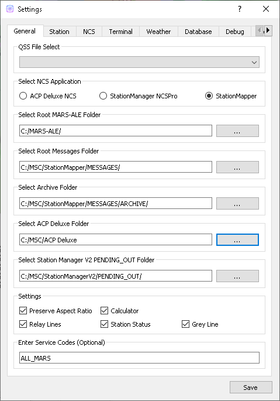
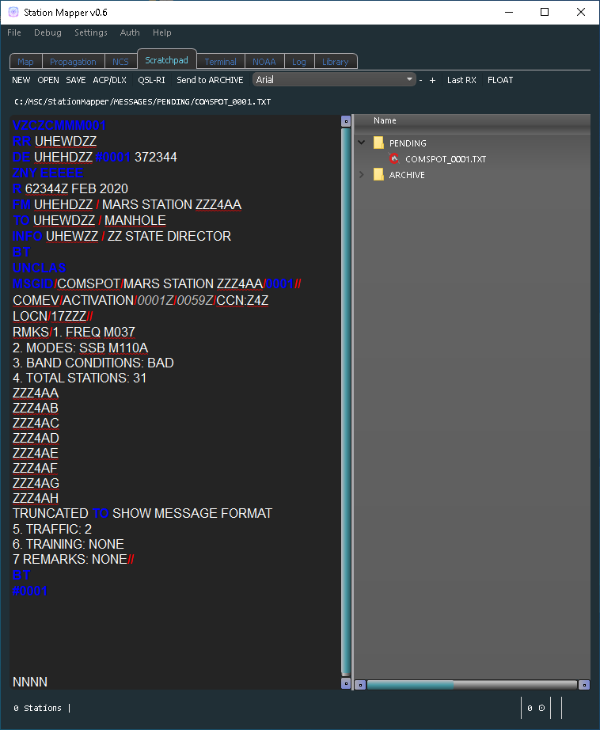
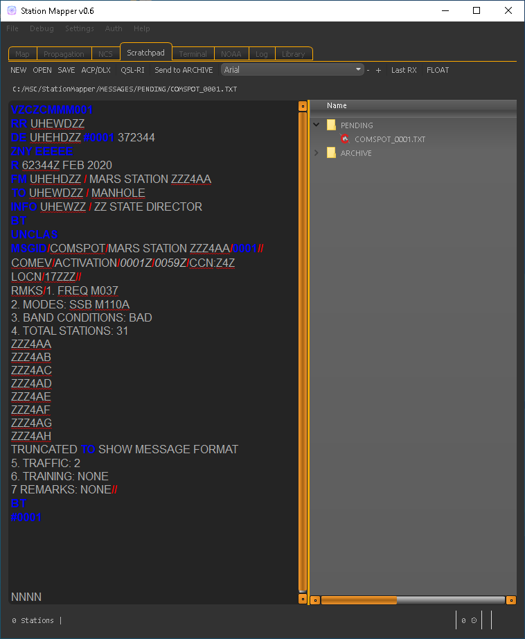
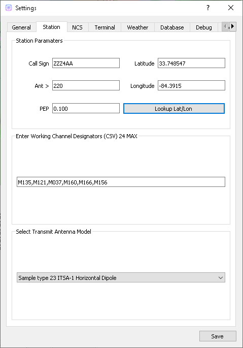
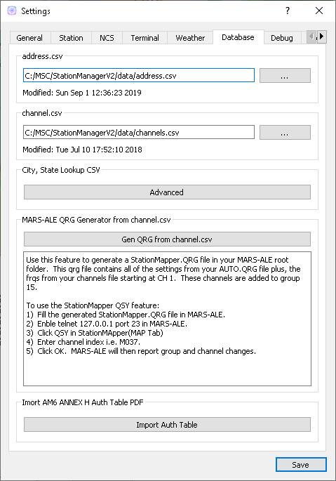
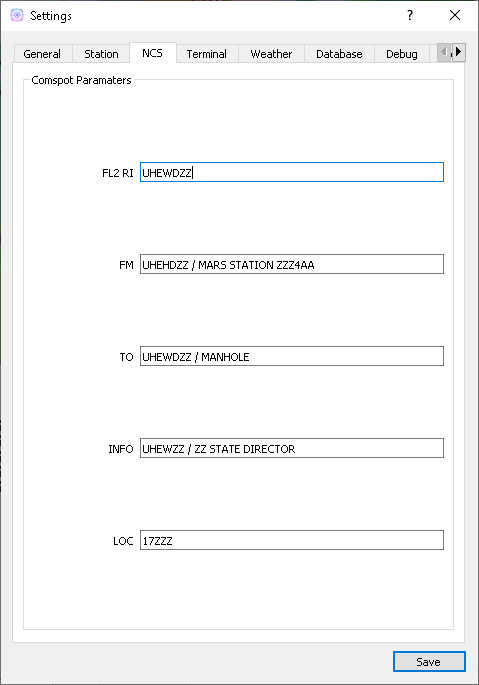
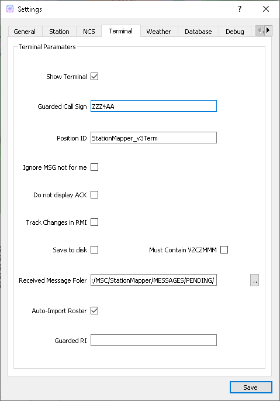

============
Configuration
============

Configuration of settings is done through the menu Configure->Settings function.

General Parameters Tab
--------

General
 - Select QSS File
	 - Choose from any file in the C:\MSC\QStyleSheets folder:
		 - Allows users with visual imparments to select styles that work for them.

 - Select NCS Application
	 - Choose from:
		 - ACP Deluxe NCS
		 - StationManager v2 NCSPro
		 - StationMapper (Build-in NCS Roster tool)
		 - Changing this setting forces StationMapper to restart.
 - Select ACP Deluxe Folder
	 - Enter the root folder for ACPDeluxe or click '...' to select one from a dialog window.
	 - The default value is "C:/MSC/ACP Deluxe/"
 - Select Station Manager V2 Folder
	 - Enter the PENDING_OUT folder for SMv2 or click '...' to select one from a dialog window.
	 - the default value is "C:/MSC/StationManagerV2/PENGING_OUT"
 - Settings
	 - Preserve Aspect Ratio
		 - Selects weather the map is forced to preserve the aspect ratio when the window is resized.
		 - May be removed in future versions and set to on permanantly.
		 - For users with small screens or many windows open at once.
	 - Calculator
		 - Selects if calculator is displayed on map window.
		 - Changing this setting forces StationMapper to restart.
	 - Font Button
		 - Displays font selection window.
		 - Size set here has no bearing on map display.
	 - Relay Lines
		 - When selected lines are drawn beteewn station that is relayed to its relay station.
	 - Station Status
		 - Closed stations are displayed in red and crossed out.
		 - Other functions will be added at a later date.
	 - Grey Line
		 - Displays the solar terminator on the map.
		 - Currently a single line moving across the screen. (v0.316)
		 - Will provide more options for this feature at a later time.

.. raw:: latex

    \newpage
Station Tab
--------

Station
 - Call sign
	 - This is used for the centerpoint of the lightning summary radius and propagation coverage overlay.  This uses the location for the call sign from the database.
	 - Latitude/Longitude this is preffered over call sign for centerpoint of the lightning search radius.
 - Ant >
	 - Antenna angle is used for propagation analysis.
 - PEP
	 - Peak Envelope Power in kW is used for propagation analysis.
 - Working Channel Designators
	 - USE CSV (Comma Seperated Values) format. i.e. A1,A2,A3
	 - These can be any channel designators listed in the channels.csv file.
	 - Used to produce the Channel Reliability Graph.
 - Transmit Antenna Model
	 - These are taken directly from the VOACAP library.  Users that have experiance with creating VOACAP antenna models can place their custom models in the samples folder and they will be loaded automatically during startup.

.. raw:: latex

    \newpage
Weather Tab
--------
Weather data & imagery powered by AerisWeather.
 - Radar Checkbox
	 - Displays weather radar overlay on map.
 - Lightning Strikes
	 - Displays a small circle on the map denoting the strike location Updates every 5 minutes with information for the last 5 minute period.
 - Cyclone
	 - Displays an overlay of any cyclone tracks and error cones that are active.
 - Lightning Summary
	 - Displays the numbers of strikes withing the summary radius for the last 5 minute period, updating every 5 minutes.
 - Summary Raduis
	 - Set to a value bettween 50 and 800 miles.  Used with lightning summary.

.. raw:: latex

    \newpage
Database Tab
--------

This tab identifies the databases that have been imported and the time of their last modification.  When these files are updated StationMapper will detect the update and import the new database.
 - address.csv
	 - "..." Selects address.csv file to import.  On a slower computer a progress dialog may display while the import is preformed.
 - channel.csv
	 - "..." Imports the channel database channel.csv.
 - Advanced
	 - Starts the 'Advanced Database Tool'
	 - Use this tool to import a user created CSV file with City, ST data.  Preforms an online lokup of City,St data and merges the result into the StationManager "Working_DB"

.. raw:: latex

    \newpage
NCS Tab
--------

.. raw:: latex

    \newpage
Use this tab to enter settings for generating a COMSPOT.

Terminal Tab
--------

Refer to v3Terminal documentation provided by MSCv3 suite for documentation of the settings.  Complete documentation of this implimentation will follow when time permits.
 - Show Terminal
	 - Displays weather radar overlay on map.
 - Guarded Call Sign
	 - Displays a small circle on the map denoting the strike location Updates every 5 minutes with information for the last 5 minute period.
 - Position ID
	 - Displays an overlay of any cyclone tracks and error cones that are active.
 - Save to disk
	 - Save all received text to files in the received file folder.
	 - Must Contain VZCZMMM
		 - Received text must contain VZCZMMM to be safed.  This attempts to filter out non-message traffic.
	 - Received file folder:
	 	 - Location to automatically store received text.
 - Auto-Import Roster
 	 - Automatically imports the turnover roster produced by NCSPro.exe and the roster produced by ACP Deluxe NCS.exe
 - Guarded RI
 	 - This setting is used to generate the QSL-RI response.