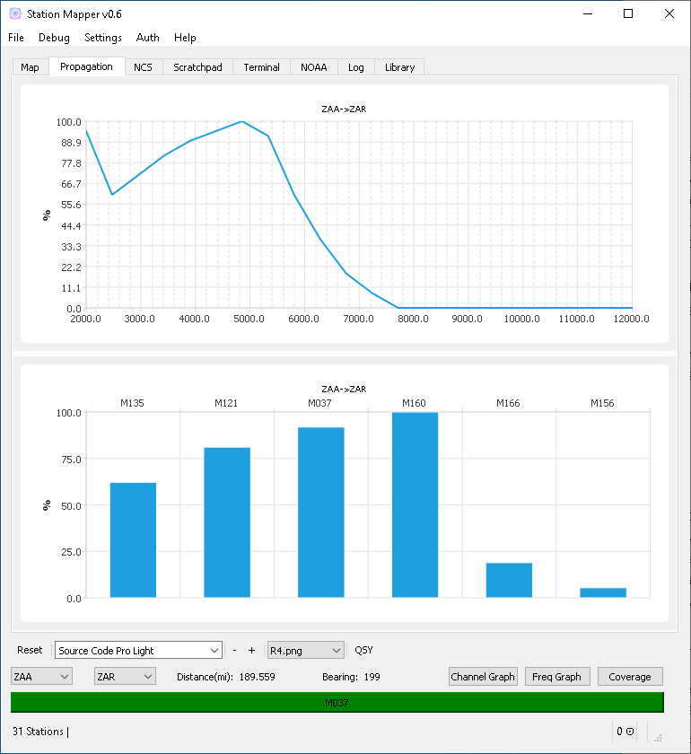
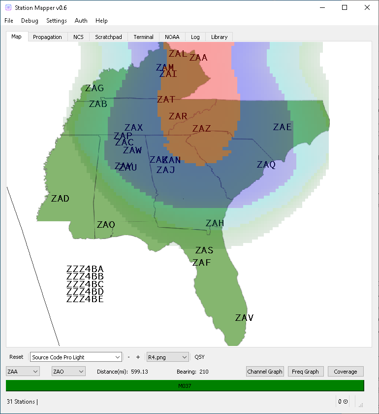
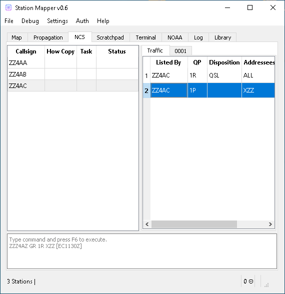
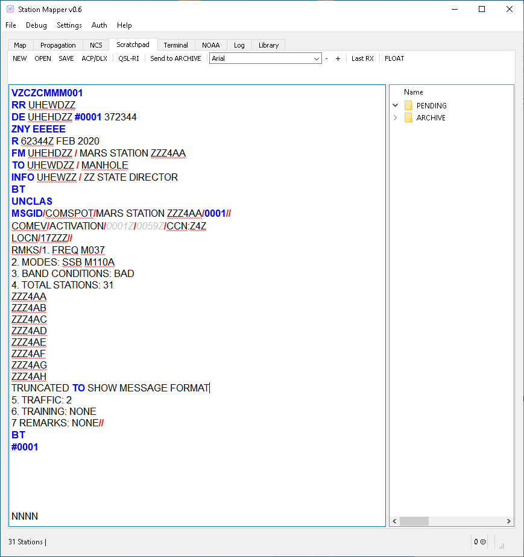
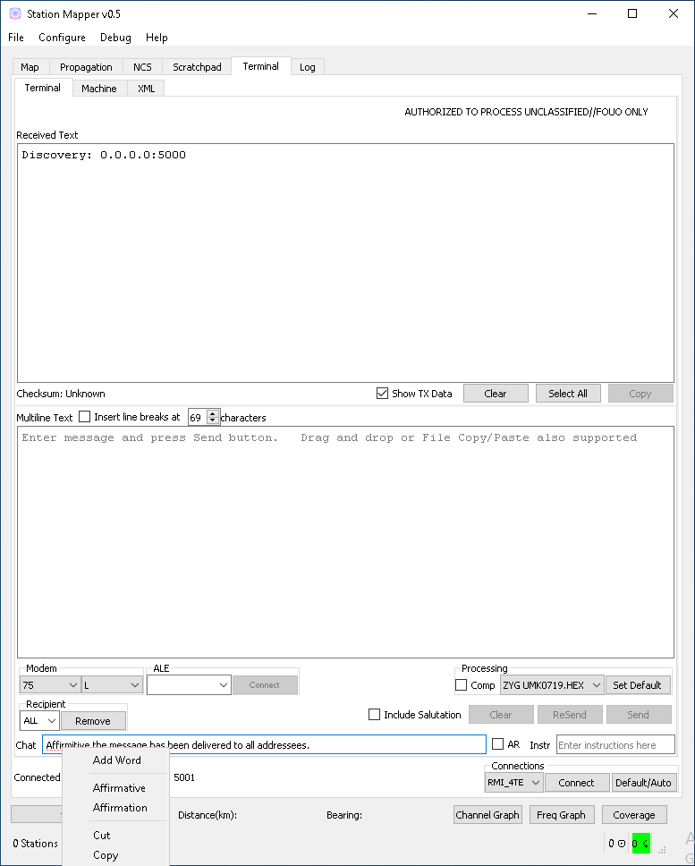

========
Usage
========

Starting StationMapper
--------

 - Start StationMapper from the Windows Start menu or desktop shortcut.
 - If you are not using the internal NCS tool, start your preffered NCS Application.
		- NCSPro.exe - StationManager
		- NCS.exe - ACPDeluxe Suite

NCS Tools
--------
 - StationMapper NCS Roster Tool (Recomended)
 	- See documentation for NCS Tab for information on how to use the internal roster tool.
 - ACP Deluxe
	- Use ACPDeluxe as described in the instructions provided with it.
	- Features
 		- Stations marked as closed (status collumn) apear in red and crossed out.
		- Stations with a 'relayed by' status (T=4ZZ) are connected to their relay by a dot-dash line.
			- Lines are color coded to identify the station relaying. i.e., If ZZZ4ZZ relays 4AA and 4AB the lines running from 4ZZ to 4AA and 4AB are the same color.
 - NCSPro
	- Use NCSPro as described in it's documentation.
	- NCSPro does not auto-update StationMapper, rather StationMapper watches the PENDING_OUT folder for files with ROSTER in the filename and imports the newest file when changed.
	- Features
		- Planning to add closed and relayed by feature
		- No additional features have been added at this time.
		- SMv2 is depreciated software and further features are not being developed.

Calculator
--------
        - Select two stations by right clicking them or selecting them from the dropdown box.  Distance and bearing are automatically updated each time the station changes.

.. raw:: latex

    \newpage
Propagation Graphs
--------

Right clicking a graph will allow you to close it.

 - Graphs are calculated based on:
        - The entered noise floor in dBm.
        - Using ideal horizontal dipoles pointed at each other.
        - Using the power selected in staiton parameters.
        - Graphs are displayed on the Progagation tab in the main windows.
        - Right clicking on the graph will allow you to close the graph.

.. raw:: latex

    \newpage
Coverage Area Overlays
--------

Overlays are generated using the VOACAP tool created by Goerge Hand.

 - Overlays
        - When you click the Coverage button you will be asked for the channel you want the overlay for.
        - Up to ten overlays can be loaded at one time.
        - You can change the current overlay by clicking on the selector buttons under the claculator row.
        - The button highlighted in green is the currently displayed overlay.
        - Right clicking on an overlay selection button will allow you to close an overlay.

Using the Mouse
--------
	- Left click centers the map in the point clicked.
	- Right click selects that station in the calculator bar.
	- Scroll wheel controls zoom level.
	- Mouse forward and back buttons adjust font scalar.
	- Left click and hold drags the map.

Changing Maps
--------
	From the menu select Configure->Choose Map
	- From this menu select the map you want displayed.
	- Users can create their own maps using an EPSG:3857 projection saved as a bmp (bitmap) file.
		- More info to follow.  This is not a simple process but users who are interested should start by downloading QGIS and creating a EPSG:3857 projection.

.. raw:: latex

    \newpage
NCS Tab
--------

To enable the built-in roster tool select StationMapper as the NCS Application from the general tab in the Settings dialog.

 - Keyboard Shortcuts
        - F6 = Command Execute.  While in the command text area F6 executes the line(s) in the text box.  While in any other area of the application F6 brings the focus to the command text area.
        - F3 = Find.  This loads the find dialog.

 - Command text area:
        - To enter a station into the roster enter the callsign in the command area and press F6, Multiple entries can be make at once, seperated by line breaks.
                - Example:
                        - ZZZ4AA
                        - ZZZ4AB
                        - ZZZ4AC
                        - ~Press F6~
        - Specifying HowCopy information at login (optional):
                - The following are the only valid inputs for how copy: WBR,WR,R,GR,LC,T=XXX Where XXX is the abreviated callsign from the imported address.csv file.  HowCopy can only follow callsign.
                - Example:
                        - ZZZ4AA GR
                        - ZZZ4AB
                        - ZZZ4AC LC
                        - ZZZ4AD T=4AA
                        - ~Press F6~
        - Listing additional status information at login (optional): Anywhere after the howcopy parameter a status entry can be made by enlosing any text in brackets [].
                - Example:
                        - ZZZ4AA [Close after traffic] 1R XKY 1R XZZ EWD
                        - ZZZ4AB T=4AA [mobile]1R XKY
                        - ZZZ4AC [info for the net]
                        - ZZZ4AD WBR [EC1130Z]
        - Listing traffic at check-in (optional):
                - Traffic must come after either callsign or howcopy but can be listed before or after [status]:
                - See previous example.

 - Using the mouse:
        - Roster right-click on station:
        	- Send Roster to Scratchpad
        		- Creates a NCSPro.exe style turnover roster and sends it to scratchpad.
        	- Send roster to Terminal
			- Creates a NCSPro.exe style turnover roster and sends it to the terminal window.
		- Send COMSPOT
			- Starts the COMSPOT creation wizard and sends the results to scratchpad.
			- Uses values from the wizard and values set in the Settings->NCS dialog.
        	- Remove - removes station from roster.
	        - Ammend Traffic:
        	        - Selecting Ammend traffic loads an input dialog.
	                - Enter the traffic and click or or press enter.
	                        - Examples:
	                          - 1R XKY 1R XZZ EWD
	                          - 1R M4A
	        - Closed: Change station status to closed and marks them out on the map.
	        - Return: Clear the station status.
	        - NCS: Change Task to NCS.
	        - ANCS: Change Task to NCS.
	        - Move Up and Down: Moves the station up or down in the roster.
.. raw:: latex

    \newpage
Scratchpad Tab
--------

Use this area to take notes prepare traffic for relay.

- Syntax Highlighting:
	- Syntax is highlighted based on REGEX rules embedded in the source code.  Future releases will give the user the ability to edit this.
- Spell Checking
	- Words not in the syntax rules or in the dictionary are underlined with a red squigle.
- Using the mouse:
	- Add Word
		- Adds unknown word to dictionary.
	- Word suggestion list.
		- Click on a sugested word to replace the text underlined by the spell checker.
	- Send to Terminal
		- Sends the entire contents of scratchpad to the terminal window.
	- Send selected
		- Sends the selected text to the terminal window.
.. raw:: latex

    \newpage
Terminal Tab
--------

This tab is based on GPL Source code for v3Terminal provided at "http://www.usarmymars.org/resources/software".  At this time please refer to the documentation provided by MSCv3 for setup and usage.  Only the major functionality changes are detailed in this document.  This functionality will be expanded in future releases and complete documentation will be provided when time permits.
 - Differences from the v3Terminal included with MCSv3
	- Orderwire text box includes spell checking.
	- Settings have been moved to the Settings->Terminal dialog.
.. raw:: latex

    \newpage
NOAA (Space Weather) Tab
--------

.. image:: ../images/SMapper_v_6_NOAATab.PNG
   :width: 604

NOAA - Space and Geophysical data is updated from the noaa website via proxy and requires an internet connection to www.kyhitech.com.
.. raw:: latex

    \newpage
Library Tab
--------

.. image:: ../images/SMapper_v_6_LibraryTab.PNG
   :width: 604

These documents are updated from the server based on the service codes entered in the general settings tab.

- Service Codes:
	- Service codes are used by MARS Staff members to publish document libraries such as schedules and netplans that my need regular updating.  StationMaller-Library offers a single point for collection authors and stations to keep documentation current.
- Upload file feature:
	- Currently in the debug menu.  MARS staff may use the upload feature to push documents to the server for processing.
- Passcode protection:
	- MARS staff may request sensitive libraries be passcode protected.  Single key symetric encryption is performed using gpg4win.